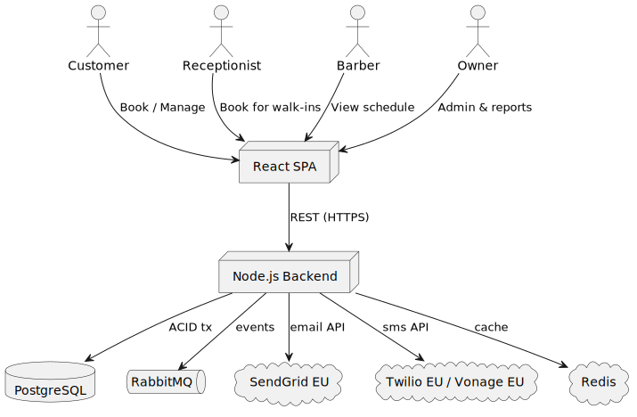

= 3. System Scope and Context
:toc:

== Business Context
Prime-Cuts Booking replaces the manual phone/appointment-book process with a web system.
The main actors and their interactions are:

*Customer* → browse available slots, book, reschedule or cancel appointments.
*Receptionist* → books on behalf of walk-in or phone clients.
*Barber* → views personal schedule, blocks breaks.
*Owner* → administers services, staff hours, views reports.

== Technical Context
The system comprises a React single-page application (SPA) and a Node.js back-end.  The back-end persists data in PostgreSQL, emits domain events to RabbitMQ, and integrates with SendGrid (EU) for email and Twilio/Vonage (EU) for SMS.  An optional Redis cache accelerates slot look-ups.

All external communication is over HTTPS.  Managed PaaS offerings provide PostgreSQL, RabbitMQ and CDN/TLS termination (Cloudflare).
