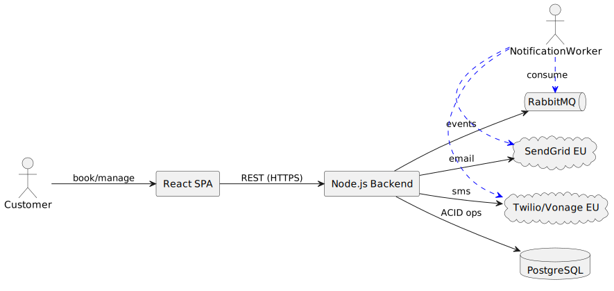

= 5. Building Block View
:toc:

== Level 1 – System
Prime-Cuts Booking consists of a React SPA front-end, a Node.js back-end (modular monolith) and auxiliary workers for notifications and reminders.

== Level 2 – Backend Modules
|===
|Module | Responsibility
|Booking Module | Create, update, cancel appointments. Enforces business rules (no overlap, ≥24 h notice).
|Schedule Module | Manages barber working hours, breaks and days off.
|Service Catalogue | CRUD for offered services (name, duration, price).
|User Module | Customer/staff registration, authentication, RBAC.
|Reporting Read Models | Pre-aggregated views for owner dashboards.
|===

== Level 3 – Key Classes / Components
* BookingService – orchestration of booking commands, writes to Outbox.
* AvailabilityQuery – calculates free slots using indexed queries + Redis cache.
* OutboxRelay – polls notification_outbox table, pushes messages to RabbitMQ.
* Notification Worker – consumes events, sends email/SMS via provider adapters.
* Reminder Scheduler – runs cron, emits ReminderNeeded events 24 h in advance.
