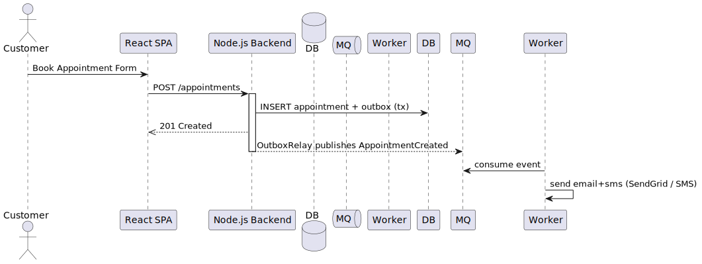

= 6. Runtime View
:toc:

== Booking Scenario – Customer Creates a New Appointment

. The customer fills in the booking form in the React SPA.
. The SPA sends `POST /appointments` to the back-end.
. The back-end executes a single database transaction that:
  .. Inserts a new `appointment` row. The table’s *exclusion constraint* verifies no overlapping appointment exists for the same barber.
  .. Inserts a row into `notification_outbox` with event *AppointmentCreated*.
. Transaction commits and the back-end returns *201 Created*.
. The OutboxRelay process immediately publishes the event to RabbitMQ.
. The Notification Worker consumes the event and sends e-mail + SMS via EU-resident providers.

== Reminder Scenario – 24 h before Appointment
1. *ReminderScheduler* runs every 5 min via PaaS scheduler.
2. It selects upcoming appointments between `now()+24h` and `now()+24h+5m` where `reminder_sent=false`.
3. Emits *ReminderNeeded* events into Outbox; marks the row.
4. The Notification Worker consumes the event and sends reminder messages.

== Error Scenario – RabbitMQ Unavailable
* If RabbitMQ is down, OutboxRelay cannot publish events. The rows stay in `notification_outbox` with `sent=false` and will be retried indefinitely (exponential back-off). No messages are lost.
