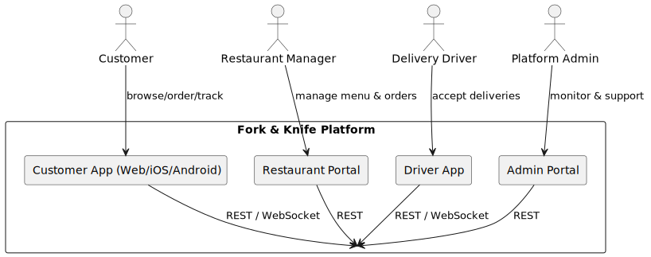

[[section-context-and-scope]]
== Context and Scope

=== Business Context

|===
|Communication Partner|Purpose|Information Exchanged
|Customer (Web/Mobile)|End-users placing orders|Menus, cart, payment, order status, driver position
|Restaurant Manager (Portal)|Manage restaurant presence|Menu data, order tickets, prep-time estimates
|Delivery Driver (App)|Fulfil deliveries|Job offers, pickup/drop-off details, navigation, status updates
|Platform Administrator (Portal)|Operate platform|Incident data, user/account management, fees, payouts
|Third-party Payment Gateways (Stripe, PayPal)|Process payments|Tokenised payment details, charge/refund status
|Mapping/Geolocation Provider (Google Maps)|Routing & ETA|Geocoding, distance matrices, map tiles
|===

=== Technical Context

All client applications communicate with the platform via HTTPS through the API Gateway.  Real-time updates are delivered using WebSocket connections upgraded at the gateway edge.  Internal microservices communicate over gRPC (synchronous) and Kafka (asynchronous) within an mTLS-secured service mesh on Kubernetes.

|===
|Channel|Protocol|Consumers|Producers
|Edge API|HTTPS/REST|Clients|API Gateway
|Edge WebSocket|WSS|Clients|Notification Service / Gateway
|Internal RPC|gRPC+mTLS|Microservices|Microservices
|Event Stream|Kafka (Protobuf)|Microservices|Microservices
|===
