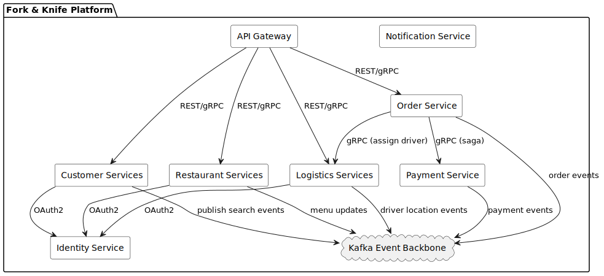
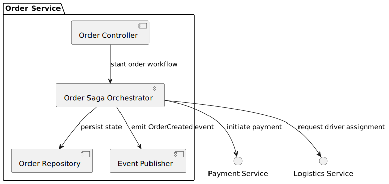
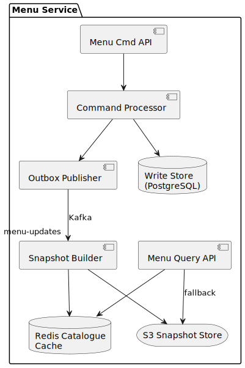

[[section-building-block-view]]
== Building Block View

=== Level 1 – System Context (see section 3)

System context diagram is provided in <<_03-context-business_diagram>>.

=== Level 2 – Container View

|===
|Container|Responsibility|Tech Stack
|API Gateway|Single entry point, auth, throttling, WS upgrades|Kong / NGINX Ingress Controller
|Customer Services|Profile, cart, search|Kotlin + Spring Boot, PostgreSQL, Redis
|Restaurant Services|Menu, kitchen order mgmt|Kotlin + Spring Boot, PostgreSQL+MongoDB
|Logistics Services|Dispatch, driver mgmt, geo-tracking|Kotlin + Spring Boot, PostgreSQL, DynamoDB
|Order Service|Lifecycle state machine, emits events|Kotlin + Spring Boot, PostgreSQL
|Payment Service|PCI-scoped payment processing|Kotlin, Stripe/PayPal SDK, PostgreSQL
|Notification Service|Push/SMS/Email fan-out|Kotlin, AWS SNS, Firebase
|Identity Service|OAuth2/OIDC, JWT|Keycloak / Cognito
|Analytics Service|Reporting, BI exports|Kotlin, ClickHouse/BigQuery
|Event Backbone|Async communication|Apache Kafka (AWS MSK)
|===

=== Level 3 – Component Example: Order Service

|===
|Component|Responsibility
|Order Controller|gRPC/REST endpoints for commands & queries
|Order Saga Orchestrator|Coordinates Payment and Dispatch
|Order Repository|Persistence of aggregate root (PostgreSQL)
|Event Publisher|Publishes order events to Kafka topics
|===

=== Level 3 – Component Example: Menu Service

|===
|Component|Responsibility
|Menu Cmd API|Write-side endpoints for restaurants
|Command Processor|Validation + persistence of menu changes
|Outbox Publisher|Tx-local outbox producing `menu-updates`
|Snapshot Builder|Generates read-optimised catalogue snapshots
|Menu Query API|Read-side endpoint for customer apps
|===
