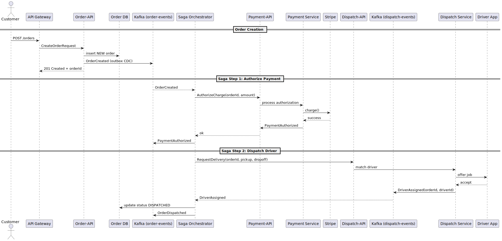

[[section-runtime-view]]
== Runtime View

This section illustrates the most architecturally significant runtime scenarios of the “Fork & Knife” platform.  Every scenario highlights how concrete building-block instances collaborate at runtime and how the system fulfils critical requirements such as real-time state propagation, payment reliability, and fault tolerance.

=== Scenario 1 – Order Placement & Checkout (Order-Payment-Dispatch Saga)

This is the _critical path_ for revenue generation and therefore the most important runtime interaction in the system.  It realises ASR-F01 (real-time updates ≤ 2 s), ASR-F02 (three-sided marketplace orchestration), and ASR-F03 (secure payments).

.Step-by-step description

. **Customer** places an order via the mobile/web client. The request is routed through the **API Gateway** to the **Order Service** (`Order-API`).
. **Order Service** persists the new order in its PostgreSQL database and writes an `OrderCreated` record in the local outbox table. Debezium CDC publishes the corresponding domain event to the Kafka topic `order-events`.
. The **Saga Orchestrator** (running inside the Order Service pod) consumes `OrderCreated`, starts a new saga instance, and invokes **Payment Service** synchronously (`AuthorizeCharge`).  Payment Service integrates with **Stripe** to authorise the credit-card payment.
. After successful authorisation, Payment Service emits `PaymentAuthorized` to Kafka; the saga proceeds to request driver dispatch via the **Dispatch Service** (`RequestDelivery`).
. Dispatch matches an available **Driver** and publishes a `DriverAssigned` event on `dispatch-events`.  The saga receives this event, updates the order status to `DISPATCHED`, and publishes `OrderDispatched`.
. All interested parties (customer app, restaurant tablet, driver app) receive real-time updates through WebSocket channels fed by the event stream.

.Error & compensation path (not shown in diagram)

* If `AuthorizeCharge` fails or times out, the saga marks the order as `PAYMENT_FAILED`, emits the event, and terminates.
* If no driver is assigned within the SLA (4 min) or `AssignmentFailed` is received, the saga calls `Refund` on Payment Service, marks the order `CANCELLED`, and publishes the compensation events.

=== Scenario 2 – Menu Update Propagation (≤ 5 s)

This scenario demonstrates how a restaurant’s menu change becomes visible to customers within five seconds, fulfilling ASR-F04.

image::../diagrams/06-menu-update-seq.svg["Menu Update Propagation – Sequence Diagram",width=900]

.Step-by-step description

. **Restaurant Manager** updates an item via **Menu Cmd API** (`UpdateItemCmd`).
. **Command Processor** validates the request, writes the change to the **Write Store** (PostgreSQL), and inserts a record into the **Outbox** table.
. **Debezium CDC** picks up the outbox record and publishes `MenuUpdate` to Kafka topic `menu-updates`.
. **Snapshot Builder** consumes `menu-updates`, rebuilds the denormalised JSON snapshot, stores it in **Redis** (hot) and **S3** (cold backup).
. **Cache Invalidation Service** also consumes `menu-updates`, batches restaurant IDs, and issues a **PURGE** call to the **CDN** to invalidate catalogue pages.
. **Customer API Facade** receives the event and pushes a `menuRefresh` WebSocket message to any active customer sessions browsing that restaurant.
. Next customer request (or existing page auto-refresh) obtains the fresh catalogue from Redis via **Menu Query API**.

.Total propagation time

* DB commit to Kafka publish: ~100 ms
* Kafka to Snapshot/Invalidation consumers: ~50–100 ms
* Snapshot build + Redis update: ~200–300 ms
* CDN purge: 100–500 ms (averaged)
* WebSocket push: ~50 ms

End-to-end: typically 1–3 s; alert if > 5 s.
