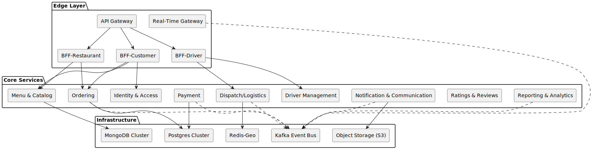

= 5. Building Block View

== 5.1 Whitebox Level 1 – System Overview

The Fork & Knife backend is decomposed into edge components (gateways & BFFs), domain microservices, and shared infrastructure.

== 5.2 Whitebox Level 2 – Core Domain Services

|===
| Component | Responsibility | Datastore | Events Published
| Identity & Access | AuthN, AuthZ, OAuth2 JWT issuance | Postgres | UserRegistered, EraseRequest, EraseCompleted
| Menu & Catalog | Menus, item availability, photos | MongoDB | MenuChanged
| Ordering | Cart, order lifecycle, payments handshake | Postgres | OrderCreated, OrderStatusUpdated
| Payment | Payment intents, captures, refunds | Postgres | PaymentCaptured, RefundIssued
| Dispatch / Logistics | Driver availability, job matching | Redis-Geo | JobOfferCreated, DriverAssigned
| Driver Management | Profiles, compliance docs, payouts | Postgres | DriverStatusUpdated
| Notification & Communication | Push, SMS, chat, masked calls | S3, MongoDB | NotificationSent, ChatMessage
| Ratings & Reviews | Customer & driver ratings | Postgres | ReputationUpdated
| Reporting & Analytics | Real-time KPIs, financial dashboards | ClickHouse (OLAP) | –
|===

== 5.3 Important Interfaces

* REST/gRPC APIs between BFFs and services (OpenAPI / protobuf schemas).
* Kafka topics with Avro schemas (Schema Registry, backward-compatible).
* Secure WebSocket channels via Real-Time Gateway.

== 5.4 Cross-cutting Infrastructure

* Kafka cluster (3 AZ) – asynchronous backbone.
* Redis-Geo – geo-spatial driver lookup.
* Object Storage (S3) – images, chat transcripts.
* Observability stack – OpenTelemetry Collector, Prometheus, Grafana.
