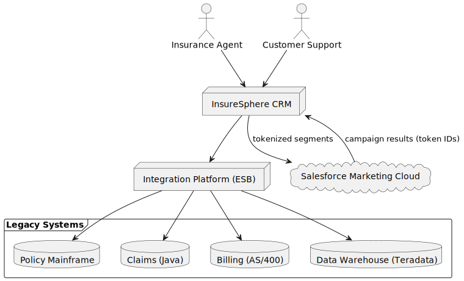

[[section-context-and-scope]]
== 3. System Scope and Context

=== 3.1 Business Context
The InsureSphere CRM serves as the **central hub** for all customer-related activities (sales, support, underwriting, marketing).  It interacts with several user groups and external systems as illustrated below.

==== Business Context Diagram

=== 3.2 Technical Context
|===
| External System | Integration Mechanism | Purpose
| Policy Mainframe | IBM MQ + nightly batch CDC | Read/write policy data
| Claims System (Java) | REST façade + events | FNOL, claims history
| Billing (AS/400) | Batch file queue, limited write window | Payment status, address sync
| Data Warehouse (Teradata) | ELT jobs (NiFi) | Analytics & reporting
| Salesforce Marketing Cloud | REST/Bulk API, webhooks | Campaign execution & ROI feedback
|===

All interactions with legacy systems are routed through an **Integration Platform (ESB)** that hosts Anti-Corruption Layer adapters.

=== 3.3 Scope
In scope:
* CRM front-end (micro-front-ends, BFF)
* Domain microservices
* Integration platform and ACL adapters
* Event backbone (Kafka), workflow engine, observability stack

Out of scope:
* Internal implementation details of legacy systems
* UI look-and-feel guidelines beyond WCAG AA
