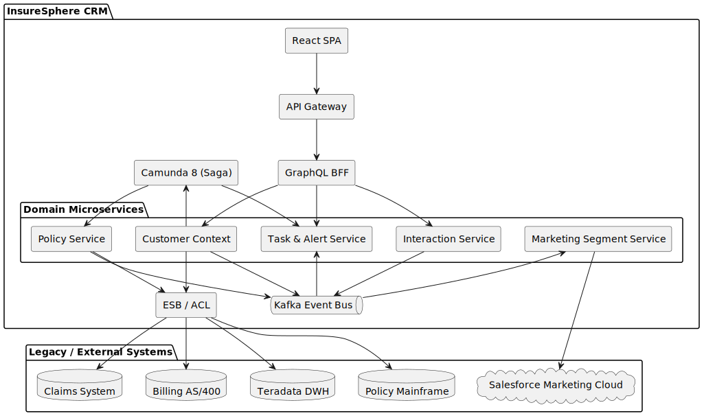

[[section-building-block-view]]
== Building Block View

This view shows the static decomposition of **InsureSphere CRM** into its main building blocks (components, subsystems, external systems) and their relationships. It provides a high-level map that helps all stakeholders understand where a given concern is implemented and how responsibilities are distributed.

=== Whitebox Overall System

==== Motivation
The decomposition follows the approved principles documented in ADR-001 (hexagonal, domain-driven, service-oriented). Each bounded context is realised as an independent microservice that exposes synchronous REST/GraphQL APIs for queries and publishes/consumes asynchronous events via Kafka for state changes. Cross-cutting runtime concerns (identity, observability, integration) are encapsulated in dedicated platform services that can be evolved independently.

==== Contained Building Blocks
[cols="1,3" options="header"]
|===
|Name | Responsibility
|React SPA | Browser-based user interface composed of micro-front-ends (Customer-360 dashboard, Quote, FNOL, etc.). Implements usability & accessibility requirements.
|API Gateway | Edge component providing routing, TLS termination, JWT/OIDC authentication, rate limiting and request logging.
|GraphQL BFF | Backend-for-Frontend that aggregates data from multiple domain services to minimise round-trips and encapsulate authorization checks.
|Customer Context Service | Owns the canonical customer master record. Implements CQRS+Event Sourcing and emits *CustomerUpdated* events.
|Interaction Service | Persists and retrieves all customer interactions (calls, e-mails, chat transcripts) to provide a chronological history.
|Task & Alert Service | Generates, stores and manages tasks/alerts for agents based on business events and SLAs.
|Marketing Segment Service | Builds dynamic customer segments and orchestrates bi-directional synchronisation with Salesforce Marketing Cloud.
|Policy Service | Provides quote generation and policy data required by other services; bridges new CRM with legacy policy domain.
|Kafka Event Bus | Highly-available messaging backbone for all domain events and command topics.
|Camunda 8 (Saga) | Workflow engine orchestrating sagas for long-running, cross-system transactions (e.g. address changes, FNOL).
|ESB / ACL Layer | Set of integration adapters (MuleSoft Runtime Fabric) that translate between CRM canonical model and legacy system protocols/data formats.
|Legacy Systems | Mainframe Policy, Claims (Java), Billing (AS/400), Teradata DWH – authoritative sources of record that remain in place.
|Salesforce Marketing Cloud | External SaaS used for marketing automation; integrated via tokenised data flows.
|===

==== Important Interfaces
* **REST / GraphQL** – synchronous query interfaces exposed by services and the BFF.
* **Kafka topics** – asynchronous command/event channels (JSON payload, CloudEvents metadata).
* **IBM MQ / Batch Files / CDC** – protocols used by ESB adapters towards legacy endpoints.
* **OIDC tokens** – propagated from Keycloak to the API Gateway and GraphQL BFF for authentication & fine-grained authorisation.

=== Level 2 – Domain Microservice Layer
The *Domain Microservices* package warrants further decomposition because it contains multiple services with similar internal structure. All domain services follow Hexagonal principles and therefore share a standard set of layers/ports:

* **API Port** – Spring MVC/GraphQL controllers validating inbound requests.
* **Application Layer** – Use-case services orchestrating domain logic, enforcing idempotency, publishing domain events via the *Outbox* table.
* **Domain Model** – Aggregate roots and entities implementing business rules.
* **Persistence Port** – Repository interfaces with Postgres (write side) and read models (Postgres/Elasticsearch) on the query side.
* **Messaging Port** – Debezium connector streams *Outbox* rows to Kafka.

A generic package diagram is provided below once per domain service (omitted here for brevity).

=== Further Levels
More detailed whitebox descriptions of individual microservices, adapters, or the ESB flow definitions will be added if and when their internal design becomes architecturally significant (complex, critical, or highly volatile).
