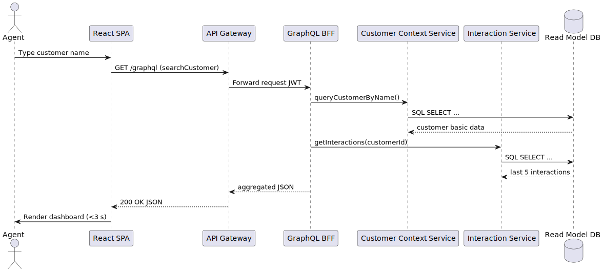
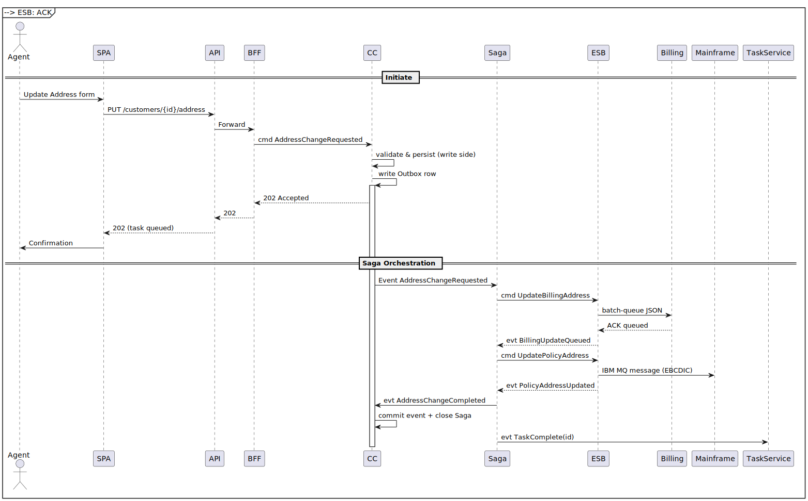

[[section-runtime-view]]
== Runtime View

This section illustrates key use-case scenarios to show how the building blocks collaborate at runtime. Sequence diagrams are used to depict the flow of control and data between components, services, and external systems.

=== Scenario 1: Customer Search & Dashboard Load (95 % ≤ 3 s)

=== Scenario 2: Address Change Propagation (≤ 5 min end-to-end)

=== Scenario 3: FNOL Initiation

// to be modelled in later iteration

=== Motivation
Runtime scenarios validate that the static architecture supports end-to-end functional and quality requirements. They also serve as reference traces for testing and monitoring (distributed tracing).
