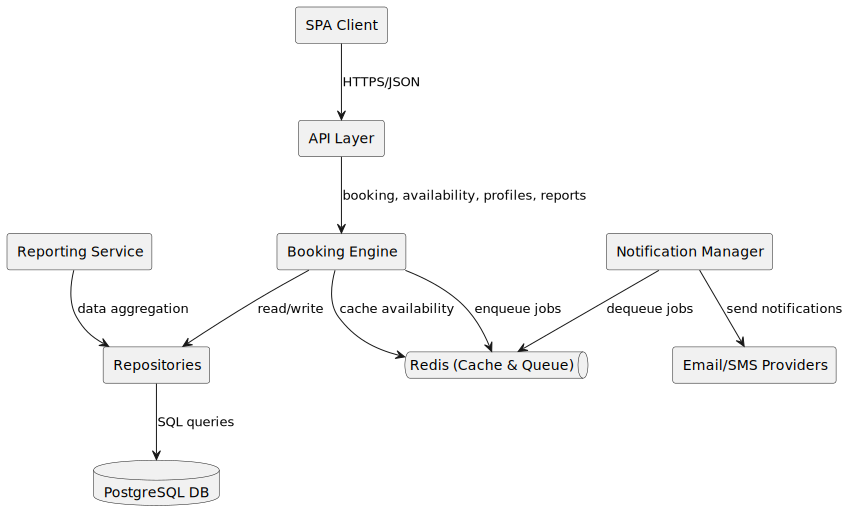

[[section-building-block-view]]
== Building Block View

This section describes the static structure of the monolithic application in terms of its major modules (building blocks), their responsibilities, and their relationships.

=== Overview Diagram

=== Building Blocks
[cols="1,2,4",options="header"]
|===
| Block Name | Layer | Responsibilities
| SPA Client | Presentation | Render booking UI; invoke REST APIs; manage client-side state and routing.
| API Layer | API | Expose controllers for authentication, customer, staff, services, bookings, reports; handle request validation and RBAC.
| Booking Engine | Business Logic | Compute availability; enforce conflict prevention; orchestrate booking workflows.
| Notification Manager | Business Logic | Consume job queue; send email/SMS notifications; schedule reminders.
| Reporting Service | Business Logic | Aggregate booking data; produce summary reports.
| Profile & History Service | Business Logic | Manage customer profiles; provide booking history access.
| Staff Management Service | Business Logic | Manage staff schedules, standard hours, and ad-hoc blocks.
| Repositories (User/Booking/Service/Staff) | Data Access | Abstract persistence operations; implement repository pattern with unit-of-work.
| PostgreSQL Database | Persistence (external) | Store domain data (bookings, users, staff, services).
| Redis Cache & Queue | Persistence (external) | Cache availability results; implement distributed locks; host job queues for notifications.
|===

=== Interactions
* The SPA client communicates over HTTPS with the API layer.
* The API delegates business operations to the appropriate service (e.g., Booking Engine for booking workflows).
* Services use repositories to read/write persistent data in PostgreSQL.
* Redis provides a fast cache for availability queries and serves as a job queue for background tasks.
* Notification Manager asynchronously processes jobs and integrates with external providers.
