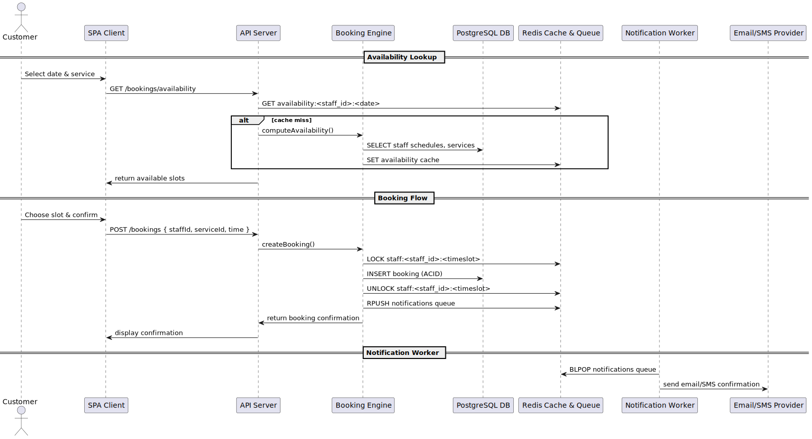

[[section-runtime-view]]
== Runtime View

This section describes key runtime scenarios of the Prime-Cuts Booking system, illustrating how building blocks collaborate during execution.

=== 1. Availability Lookup Scenario

Flow:
. Customer selects date and service in the SPA
. SPA requests GET /bookings/availability from API Layer
. API Layer checks Redis cache; on miss, invokes Booking Engine
. Booking Engine reads staff schedules and services from PostgreSQL
. Booking Engine computes slots, caches result in Redis, returns slots
. API Layer returns JSON list of available slots to SPA

=== 2. Booking Creation and Notification Scenario

Flow:
. Customer confirms a slot in the SPA
. SPA posts booking data to API Layer
. API Layer invokes Booking Engine to create booking
. Booking Engine acquires distributed lock in Redis, inserts booking in PostgreSQL, releases lock
. Booking Engine enqueues notification job in Redis queue
. API Layer returns confirmation to SPA
. Notification Manager worker dequeues job, calls external Email/SMS provider, updates job status

These runtime interactions ensure consistency (no double bookings), performance (caching), and asynchrony (notifications).
