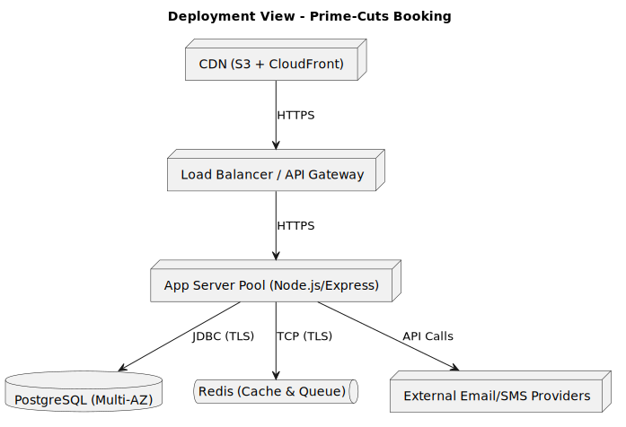

[[section-deployment-view]]
== Deployment View

This section describes how the system’s components map onto the physical infrastructure.

=== Nodes and Their Roles
* **CDN (S3 + CloudFront)**: Hosts and delivers static SPA assets with low latency.
* **Load Balancer / API Gateway**: Terminates TLS, enforces rate-limits, and routes requests to application servers.
* **App Server Pool**: Containerized instances of the monolithic backend (Node.js/Express) behind the load balancer. Scales horizontally.
* **PostgreSQL DB (Multi-AZ)**: Provides durable ACID persistence for domain data; deployed in a multi-availability-zone configuration for high availability.
* **Redis (Cache & Queue)**: Single logical Redis cluster used for caching availability data, distributed locks, and queuing background jobs.
* **External Email/SMS Providers**: Third-party services consumed by the Notification Manager via outbound HTTPS calls.

=== Deployment Considerations
* Auto-scaling on App Server Pool based on CPU/memory and request latency metrics.
* Health checks on application instances; automated redeployment on failure.
* Regular, automated database backups and point-in-time recovery.
* Secure networking (VPC, private subnets for DB/Redis, firewall rules).
