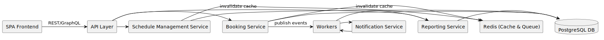

[[section-building-block-view]]
== 5. Building Block View

The system is decomposed into the following major building blocks:

* SPA Frontend: A mobile-first single-page application (React or Vue.js) handling user interactions and rendering.
* API Layer: RESTful or GraphQL endpoints over HTTPS, routing requests to domain services.
* Booking Service: Core service for computing availability and managing bookings within ACID transactions.
* Schedule Management Service: Manages services, staff profiles, working hours, and blocked slots.
* Notification Service: Subscribes to booking events and dispatches email/SMS notifications via external gateways.
* Reporting Service: Aggregates booking data to provide operational reports (daily/weekly/monthly).
* PostgreSQL DB: Primary relational database for persistent storage, encrypted at rest.
* Redis (Cache & Queue): In-memory store for availability caching and job queue backing.
* Workers: Background processing nodes that handle queued notification and reporting jobs.

