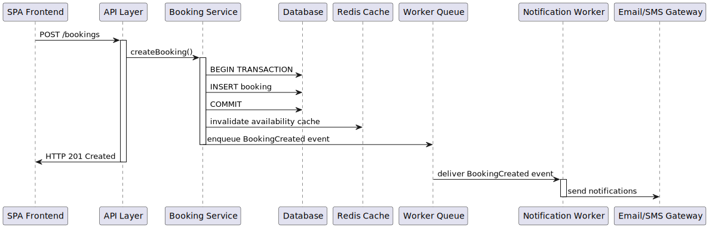

[[section-runtime-view]]
== 6. Runtime View

Overview of typical runtime scenarios:

=== Booking a Slot

1. The SPA issues POST /bookings.
2. API Layer delegates to Booking Service.
3. Booking Service opens a DB transaction, creates the booking, commits, invalidates cache, and enqueues a BookingCreated event.
4. The API returns HTTP 201 Created.
5. Worker dequeues the event and Notification Service sends email/SMS via external gateway.

=== Admin Schedule Update

1. Admin SPA issues PUT /staff/{id}/schedule.
2. API Layer delegates to Schedule Management Service, which updates PostgreSQL and invalidates relevant cache keys.
3. Future availability queries reflect updated schedule.

=== Generating Reports

1. Admin SPA issues GET /reports?period=month.
2. API Layer delegates to Reporting Service.
3. Reporting Service queries either read-replica or materialized views to aggregate data, returns report within 5s.
