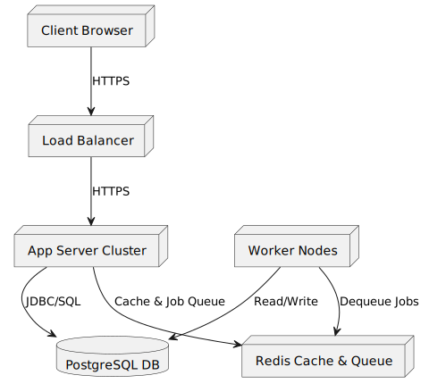

[[section-deployment-view]]
== 7. Deployment View

tree the main deployment components:

Components:
* Client Browser: SPA served over CDN or app server.
* Load Balancer: TLS termination and request distribution.
* App Server Cluster: Stateless containers running the monolithic backend.
* PostgreSQL Primary + Read Replicas: Encrypted at rest.
* Redis: In-memory cache and queue storage.
* Worker Nodes: Process background jobs (notifications, reporting).

Network:
* All traffic encrypted (TLS 1.2+).
* Ports: 443 for client/API, 5432 for DB (internal), 6379 for Redis (internal).
* VPC or private subnets for DB and Redis.
* Auto-scaling groups for app servers and workers.
