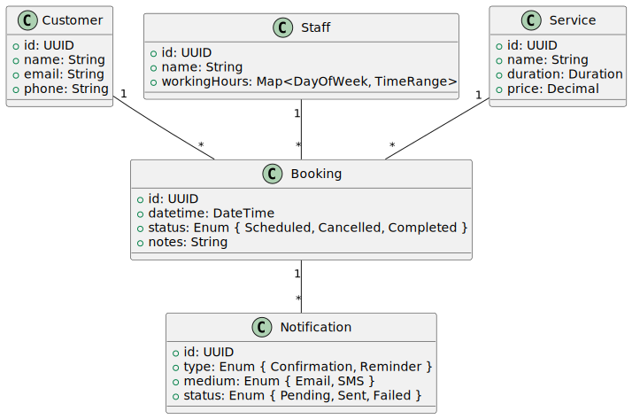

[[section-concepts]]
== 8. Cross-Cutting Concepts

=== Conceptual Data Model

Entities:
* Customer: User profile with contact details.
* Staff: Barber or receptionist with working hours and blocks.
* Service: Defines available services, duration, and price.
* Booking: Associates customer, staff, service, datetime, and notes.
* Notification: Tracks confirmation and reminder messages.

=== Event-Driven Integration

BookingCreated, BookingChanged, BookingCancelled events are published to Redis-based queue. Notification and Reporting workers subscribe to these events to process asynchronously.

=== Security

* Transport Layer Security: HTTPS/TLS 1.2+.
* Authentication/Authorization: JWT or secure sessions with CSRF protection.
* Data Encryption: PII encrypted at rest via KMS-managed keys.

=== Caching Strategy

* Cache-aside: Availability queries are cached in Redis for 5–10s.
* Invalidation: After booking or schedule update, relevant keys are removed.
