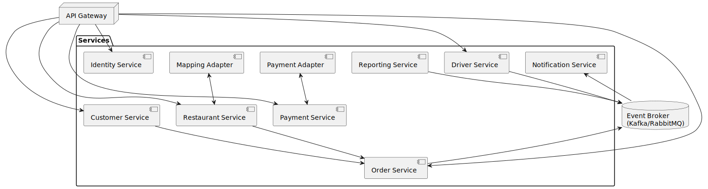

[[section-building-block-view]]
== Building Block View

=== Whitebox Overall System

The system is decomposed into independently deployable microservices that interact via a central API Gateway and an event broker. Below is the high‐level overview diagram of the static structure.

Motivation::
A microservices architecture enables independent development, deployment, and scaling of bounded contexts. The API Gateway centralizes cross‐cutting concerns (authentication, routing, rate limits), while the event broker decouples real‐time communication among services.

Contained Building Blocks::
|===
| Name                            | Responsibility
| API Gateway                     | Unified entry point for clients; handles TLS termination, OAuth2/JWT authentication, rate limiting, and request routing.
| Identity & Access Service       | Manages user identities, roles, and OAuth2 flows; issues and validates JWTs for clients and inter-service calls.
| Customer Service                | Handles restaurant browsing, filtering, a customer’s cart, checkout orchestration, and favorites management.
| Restaurant Service              | Manages restaurant menus, availability flags, order intake (with offline queuing), and preparation-time updates.
| Order Service                   | Core domain logic for order placement, validation, and lifecycle transitions; publishes and consumes domain events.
| Driver Service                  | Manages driver profiles, online/offline status, job matching, and location updates; emits driver-related events.
| Payment Service                 | Integrates with external payment providers (e.g., Stripe), ensures PCI-DSS compliance, and handles payments/refunds.
| Notification Service            | Subscribes to domain events and pushes real-time notifications to web/mobile clients via WebSockets, SMS, or email.
| Reporting Service               | Consumes event streams to build analytics, financial reports, and dashboards for restaurants and administrators.
| Mapping Adapter                 | Abstracts geocoding and routing via Google Maps (with failover to backup provider).
| Payment Adapter                 | Abstracts external payment gateway SDK (e.g., Stripe) for tokenized transactions.
| Event Broker                    | Central message broker (Kafka or RabbitMQ) for asynchronous, real-time event-driven communication.
|===

=== Level 2 and 3
Detailed inner structures of services (e.g., Order Service’s command and event handlers, or the Notification Service’s push adapter components) will be specified in the next documentation iteration, focusing on high-risk or complex modules.
