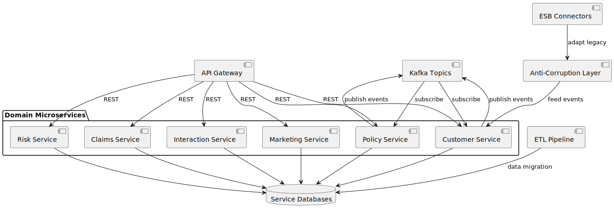

[[section-building-block-view]]
== Building Block View

The building block view decomposes the system into logical components and shows their relationships.

=== Components
* API Gateway: Central entry point for frontend and external API calls. Handles routing, auth, rate-limiting, and logging.
* ESB Connectors: Adapters for legacy systems (mainframe, claims, billing, DWH). Communicate via MQ, SOAP, FTP, or CDC.
* Anti-Corruption Layer: Transforms legacy models into the CRM's canonical domain model and vice versa.
* Kafka Topics: Event backbone for near-real-time data distribution across microservices.
* Domain Microservices: Each context is implemented as a separate service with its own database:
** Customer Service: Manages customer master data, search, and updates.
** Policy Service: Handles policy data retrieval and updates.
** Claims Service: Initiates and tracks claims workflows.
** Interaction Service: Logs interactions and manages tasks/alerts.
** Marketing Service: Creates segments and manages exports to marketing platforms.
** Risk Service: Calculates and stores risk scores.
* Service Databases: Polyglot persistence for each microservice (relational or NoSQL as appropriate).
* ETL Pipeline: Automated data migration and cleansing from legacy systems into service databases.
