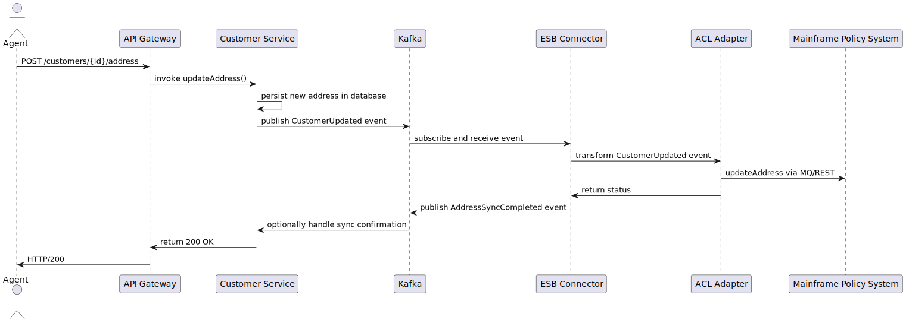

[[section-runtime-view]]
== Runtime View

This section illustrates how the components interact during key runtime scenarios.

=== Change Address Scenario

1. The Insurance Agent updates an address via the CRM UI (HTTPS POST).
2. API Gateway forwards the request to Customer Service.
3. Customer Service persists the change and publishes a CustomerUpdated event on Kafka.
4. ESB Connector (subscribed to Kafka) receives the event and passes it to the ACL.
5. ACL adapts and forwards the update to the Mainframe Policy System via MQ or REST.
6. Mainframe Policy System returns status; ACL and ESB handle retries or errors.
7. ESB publishes an AddressSyncCompleted event on Kafka if successful.
8. Customer Service processes the sync confirmation (optional) and returns HTTP 200 to UI.
